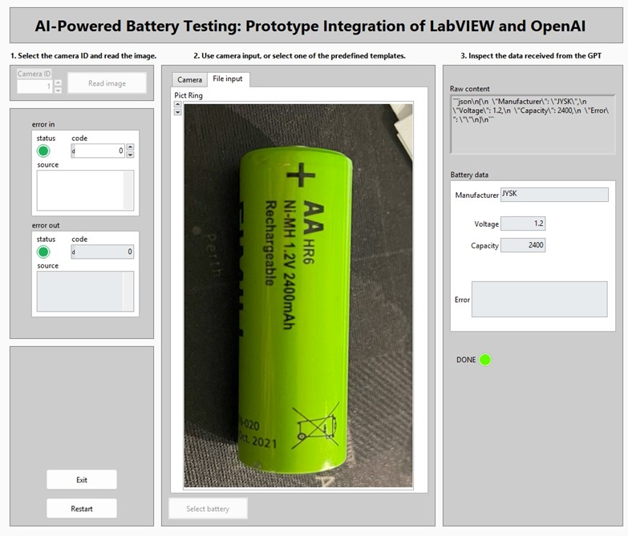

# Battery Reader POC

A proof of concept for reading battery data (OCR) from LabVIEW using the OpenAI API.

## Overview

While preparing the user actions for the AA Battery Test Rig, I spotted an old USB webcam on my desk. My first thought was, “Cool—the report will include an image of the UUT.” But I’ve been using various LLMs as OCR engines for some time now, and they’re excellent at extracting and translating text. Need Italian text from a screenshot translated into English? No problem. Need code transcribed from a YouTube Live Coding screenshot? Done.

So I’ve decided to try out an LLM in LabVIEW: read out the battery’s capacity from a webcam image and automatically populate the details. In the past, this would have required NI-IMAQ; now I simply send the webcam image to the OpenAI API and receive a human-readable result.

Using an LLM for OCR offers several benefits:

1. **Readable errors**: If something goes wrong, you get a clear, natural-language explanation rather than an obscure error code.  
2. **Flexible alignment**: The UUT doesn’t have to be perfectly oriented or framed, as long as the text is legible.  
3. **Rapid development**: The main requirements are internet access and API usage costs. Implementation time is minimal. You can even build an agent to decide when to retake an image or which sample to use, rather than forcing the operator to make those calls.

## Usage



The user follows three simple steps:

1. **Select the camera ID**  
   Enter the integer that identifies your camera in Windows (0 for the first camera, 1 for the second, etc.).  
2. **Choose an image**  
   Either use an image captured by the selected camera or pick a predefined image (handy if your webcam is low-resolution).  
3. **Process the image**  
   The app builds and sends a prompt to the OpenAI API. LabVIEW doesn’t yet include a proper JSON toolkit, so this example constructs the JSON payload with string operations. The response is parsed and the extracted battery details populate your data structure.

## Requirements

- A working USB webcam  
- LabVIEW 202x  
- JKI State Machine package

## Installation

```bash
# Clone the repository
git clone https://github.com/yourusername/aa-battery-test-rig.git

# Navigate to the project directory
cd experiments/battery-reader-poc/project

# Open the LabVIEW project
# battery-reader.lvproj
```

## License
This project is released under the MIT License.